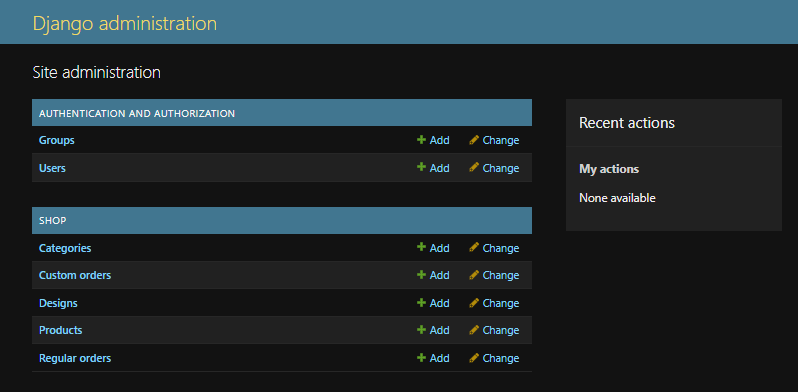

# DoodleWear 👕

A full-stack Django-based e-commerce platform for custom apparel, featuring product browsing, shopping cart management, secure authentication, Razorpay payment integration, and personalized T-shirt design functionality.

---

## Features

- 🔐 User Registration & Authentication
- 🛍️ Product Catalog
- 👕 Custom T-Shirt Design
- 🛒 Shopping Cart
- 💳 Razorpay Payment Integration
- 📦 Order Management
- 📧 Contact Form
- ⚙️ Django Admin Panel

---

## Tech Stack

- Python
- Django
- SQLite
- HTML
- CSS
- JavaScript
- Bootstrap
- Razorpay API

---

## Installation

### Clone Repository

```bash
git clone https://github.com/Krishna-Singh-1/DoodleWear.git
cd DoodleWear
```

### Create Virtual Environment

```bash
python -m venv venv
```

Windows

```bash
venv\Scripts\activate
```

Linux/macOS

```bash
source venv/bin/activate
```

### Install Dependencies

```bash
pip install -r requirements.txt
```

### Apply Migrations

```bash
python manage.py migrate
```

### Run the Server

```bash
python manage.py runserver
```

Open:

```
http://127.0.0.1:8000/
```

---

# Screenshots

## 🏠 Home Page


---

## 🛍️ Shop Page


---

## 👕 Product Details


---

## 🎨 Custom Design


---

## 🛒 Shopping Cart


---

## 💳 Checkout


---

## 📦 Order Confirmation


---

## 🔐 Admin Dashboard



---

## Future Improvements

- AI-powered T-shirt design generation
- Smart size recommendation
- Personalized product recommendations
- Product ratings & reviews
- Wishlist functionality
- Admin analytics dashboard
- Inventory prediction using Machine Learning
- AR Virtual Try-On
- Background removal for uploaded designs
- Email notifications
- Order tracking
- REST API for mobile application

---

## Author

**Krishna Singh**

GitHub: https://github.com/Krishna-Singh-1g