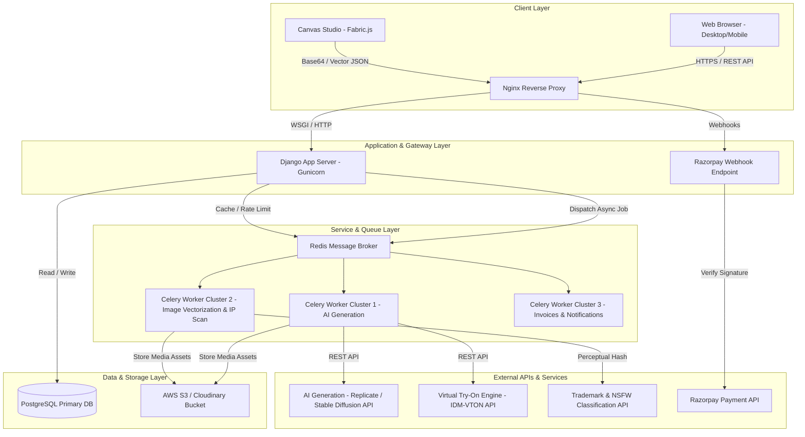
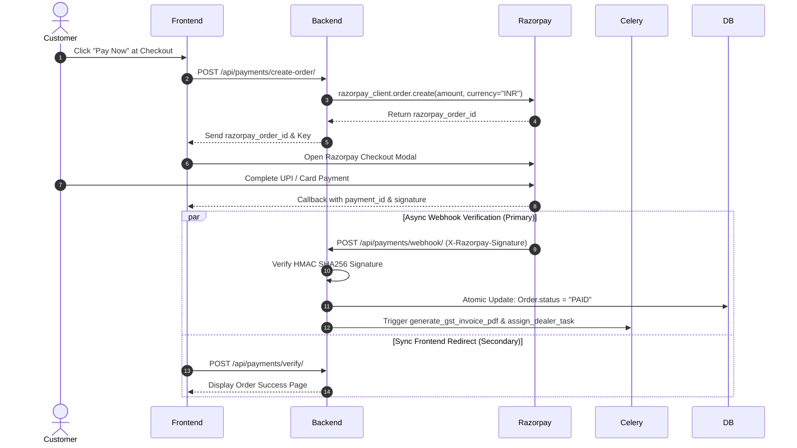

# DoodleWear — Technical Architecture & Infrastructure (architecture.md)

---

## 📌 Executive Summary

This document details the system architecture, component stack, AI integration pipelines, payment infrastructure, background task orchestration, database architecture, and deployment strategy for **DoodleWear**.

The architecture is built on **Django 5.x** with a modular structure, **Celery + Redis** for asynchronous job queues, **Fabric.js** for frontend canvas rendering, external **Generative AI microservices**, and **Razorpay** for payment processing.

---

## 1. High-Level System Architecture



---

## 2. Technology Stack

| Layer | Technology | Purpose & Rationale |
| :--- | :--- | :--- |
| **Core Framework** | Python 3.12 + Django 5.x | High reliability, built-in ORM, admin panel, robust security ecosystem. |
| **API Layer** | Django REST Framework (DRF) | RESTful API endpoints, serializer validation, JWT/Session authentication. |
| **Database** | PostgreSQL 16 | Relational database supporting JSONB fields for custom canvas layouts. |
| **Caching & Broker** | Redis 7.x | High-speed cache for catalog data, session store, and Celery task broker. |
| **Task Queue** | Celery 5.x | Asynchronous execution of AI generation, image upscaling, PDF invoices, and emails. |
| **Frontend Studio** | HTML5, CSS3, JavaScript, Fabric.js | 2D canvas manipulation, true-color fabric simulation, interactive layer editing. |
| **Payment Gateway** | Razorpay SDK & Webhooks | UPI, Cards, NetBanking, and automated refund handling for the Indian market. |
| **Object Storage** | AWS S3 / Cloudinary | Secure storage for high-res print files, user uploads, and AI try-on previews. |
| **Reverse Proxy / Server**| Nginx + Gunicorn | SSL termination, static file serving, rate limiting, and request routing. |

---

## 3. Django App Architecture

The codebase is organized into domain-driven modular Django apps:

```
ecommerce/
├── manage.py
├── ecommerce/                # Project Settings & URLs
│   ├── settings.py
│   ├── urls.py
│   └── celery.py
├── apps/
│   ├── users/                # Authentication, RBAC, Profiles
│   ├── products/             # Catalog, Apparel, Categories, Inventory
│   ├── customization/        # Canvas state, Templates, Drafts
│   ├── ai_engine/            # AI Generator, Try-On, Upscaler, Content Moderation
│   ├── orders/               # Orders, Cart, LineItems, Defect Reprints
│   ├── payments/             # Razorpay API, Webhook, GST Invoice PDF
│   ├── dealers/              # Print queue, Onboarding, Stock control, Payouts
│   ├── logistics/            # Shipping Agency queue, Tracking, OTP delivery
│   └── marketplace/          # Designer Leaderboard, Royalty Wallet, Storefronts
```

---

## 4. Asynchronous Task Queue Architecture (Celery + Redis)

AI generation and image processing tasks are CPU/GPU-intensive and long-running ($3s - 15s$). To maintain sub-2-second HTTP response times, all heavy tasks execute asynchronously.

### 4.1 Celery Queue Assignment

```python
# settings.py Celery Route Configuration
CELERY_TASK_ROUTES = {
    'apps.ai_engine.tasks.generate_ai_design': {'queue': 'ai_generation'},
    'apps.ai_engine.tasks.virtual_try_on': {'queue': 'ai_tryon'},
    'apps.ai_engine.tasks.screen_content_and_ip': {'queue': 'moderation'},
    'apps.ai_engine.tasks.upscale_and_vectorize': {'queue': 'image_processing'},
    'apps.payments.tasks.generate_gst_invoice_pdf': {'queue': 'documents'},
    'apps.orders.tasks.send_order_notifications': {'queue': 'notifications'},
}
```

---

## 5. AI Suite Integration & Pipelines

### 5.1 AI Design Generator Pipeline
1. **Request**: Customer submits prompt via POST `/api/ai/generate-design/`.
2. **Task Queue**: Django returns a `task_id` (`202 Accepted`) and queues `generate_ai_design.delay(prompt, style)`.
3. **Execution**: Celery worker calls Stable Diffusion / Replicate API.
4. **Output**: 4 image variations generated, uploaded to S3, and WebSocket/Polling endpoint notifies frontend.

### 5.2 AI Content Moderation & IP Protection Pipeline
1. **Perceptual Hashing**: Uploaded artwork is hashed using `ImageHash` (Difference Hash / Average Hash).
2. **Trademark Matching**: Hash is compared against a pre-indexed vector database of registered trademarks (Nike, Adidas, Disney).
3. **NSFW Classifier**: Google Vision API / Hive AI scans image for explicit or hate imagery.
4. **Verdict**:
   - `Passed`: Allowed to proceed to print queue.
   - `Flagged`: Placed in Admin Moderation Queue (`Order.status = "PENDING_MODERATION"`).

### 5.3 AI Virtual Try-On Engine Pipeline
1. **Input**: User photo + Garment canvas design.
2. **Pose Detection**: MediaPipe / OpenPose detects torso coordinates and posture.
3. **Diffusion Warping**: IDM-VTON / TryOnDiffusion API warps the garment onto the detected torso with natural shadows and fabric folds.
4. **Data Retention**: Result rendered to user; photo auto-deleted from server memory after 24h unless user opts to save to profile.

---

## 6. Payment & Webhook Architecture (Razorpay)



---

## 7. Security & Compliance Architecture

- **Authentication**: JWT (JSON Web Tokens) with short-lived access tokens (15 mins) and HTTP-Only Secure refresh cookies (7 days).
- **Role-Based Access Control (RBAC)**: Custom Django permissions (`IsCustomer`, `IsDealer`, `IsShippingAgent`, `IsAdmin`).
- **Private Print Asset Protection**: High-res 300 DPI print files are stored in private AWS S3 buckets. Dealers receive time-limited (15-minute) pre-signed URLs to download print packages.
- **GST Legal Compliance**: Automatic SGST/CGST/IGST calculation based on state codes, emitting tax invoices with HSN code `6109` (T-Shirts/Apparel).
- **Data Protection**: User photos uploaded for Virtual Try-On are auto-purged from storage via a daily Celery Cleanup Cron Job (`delete_expired_tryon_photos`).

---

## 8. Database Schema Overview (Entity Relationship Preview)

Detailed in `database.md`, key core entities include:
- `User` (Custom AbstractUser with role flags).
- `Product` & `ProductVariant` (Apparel, colors, sizes, stock levels).
- `CustomDesign` (Canvas Fabric.js JSON state, high-res PNG URL, AI prompt metadata).
- `Order` & `OrderItem` (Status pipeline, pricing, tax breakdown).
- `PrintJob` (Dealer assignment, print file package URL, QC status).
- `Shipment` (Shipping agency, AWB tracking number, OTP verification).
- `DesignerRoyalty` (Creator wallet balance, payout ledger).

---

## 9. Production Infrastructure & Deployment

```
[ Nginx Reverse Proxy (SSL / Port 443) ]
           │
           ├── static.doodlewear.com  ──> AWS S3 CDN (Static Files)
           │
           ├── doodlewear.com/api/    ──> [ Gunicorn (Django App - 4 Workers) ]
           │                                    │
           │                                    ├──> [ PostgreSQL 16 ]
           │                                    │
           │                                    └──> [ Redis 7 (Broker & Cache) ]
           │                                                │
           └────────────────────────────────────────────────┼──> [ Celery Workers (AI / Jobs) ]
                                                            └──> [ Celery Beat (Cron) ]
```

---

## 🎯 Summary of Documentation Progress

- [x] **1. Requirements (`features.md`)** — Complete
- [x] **2. User Flows (`user-flow.md`)** — Complete
- [x] **3. Design System (`design.md`)** — Complete
- [x] **4. Technical Architecture (`architecture.md`)** — Complete
- [ ] **5. Database Schema (`database.md`)** — *Next Step*
- [ ] **6. API Specification (`api.md`)**
- [ ] **7. Development Roadmap (`roadmap.md`)**
