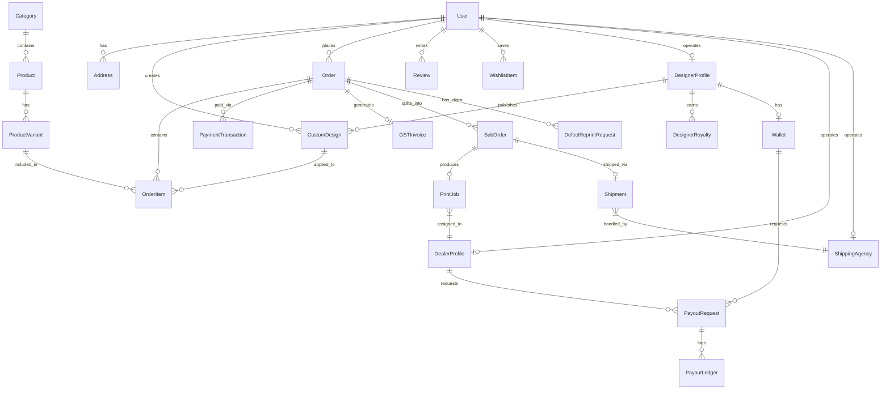

# DoodleWear — Database Schema & Data Models (database.md)

---

## 📌 Executive Summary

This document defines the relational database architecture for **DoodleWear**, implemented using **PostgreSQL 16**.

The schema supports multi-role access control (Customers, Dealers, Designers, Logistics, Admins), custom 2D canvas states via `JSONB`, AI generation job tracking, order fulfillment pipelines, GST tax breakdowns, multi-dealer order splitting, and payout ledgers.

---

## 1. Entity Relationship Diagram (ERD)



---

## 2. Table Schemas & Data Models

---

### 2.1 Users & Authentication (`apps/users`)

#### `users_user`
| Field Name | Type | Constraints | Description |
| :--- | :--- | :--- | :--- |
| `id` | UUID | Primary Key | Default `uuid_generate_v4()` |
| `email` | VARCHAR(255) | Unique, Index | User email address |
| `phone` | VARCHAR(15) | Nullable | Contact number for OTP/Logistics |
| `role` | VARCHAR(20) | Enum | `CUSTOMER`, `DEALER`, `DESIGNER`, `LOGISTICS`, `ADMIN` |
| `is_verified` | BOOLEAN | Default `False` | Email/Phone OTP verification status |
| `oauth_provider`| VARCHAR(20) | Nullable | `GOOGLE`, `APPLE`, or `NULL` |
| `created_at` | TIMESTAMPTZ | Auto now add | Account registration timestamp |

#### `users_address`
| Field Name | Type | Constraints | Description |
| :--- | :--- | :--- | :--- |
| `id` | UUID | Primary Key | Unique address ID |
| `user_id` | UUID | FK -> `users_user.id` | Owner user |
| `full_name` | VARCHAR(100) | Not Null | Recipient name |
| `address_line1` | TEXT | Not Null | Street address |
| `city` | VARCHAR(50) | Not Null | City |
| `state` | VARCHAR(50) | Not Null | State (used for CGST/SGST vs IGST) |
| `state_code` | VARCHAR(2) | Not Null | 2-digit Indian State GST Code |
| `pincode` | VARCHAR(10) | Not Null | Postal PIN code |
| `is_default` | BOOLEAN | Default `False` | Primary shipping address tag |

---

### 2.2 Products & Catalog (`apps/products`)

#### `products_category`
| Field Name | Type | Constraints | Description |
| :--- | :--- | :--- | :--- |
| `id` | UUID | Primary Key | Category ID |
| `name` | VARCHAR(100) | Not Null | e.g. "Oversized T-Shirts", "Hoodies" |
| `slug` | VARCHAR(100) | Unique, Index | URL friendly slug |

#### `products_product`
| Field Name | Type | Constraints | Description |
| :--- | :--- | :--- | :--- |
| `id` | UUID | Primary Key | Product ID |
| `category_id` | UUID | FK -> `products_category.id` | Product category |
| `title` | VARCHAR(255) | Not Null, Search Index | Apparel title |
| `base_price` | DECIMAL(10,2) | Not Null | Base un-customized price (INR) |
| `fabric_gsm` | INT | Not Null | Fabric weight (e.g. 240 GSM) |
| `is_eco_friendly`| BOOLEAN | Default `False` | Sustainability tag |
| `is_active` | BOOLEAN | Default `True` | Visibility status |

#### `products_productvariant`
| Field Name | Type | Constraints | Description |
| :--- | :--- | :--- | :--- |
| `id` | UUID | Primary Key | Variant ID |
| `product_id` | UUID | FK -> `products_product.id` | Parent product |
| `color_name` | VARCHAR(50) | Not Null | Color (e.g. "Navy Blue") |
| `color_hex` | VARCHAR(7) | Not Null | Hex code `#0A192F` |
| `size` | VARCHAR(10) | Enum | `S`, `M`, `L`, `XL`, `XXL` |
| `stock_count` | INT | Check `>= 0` | Real-time live inventory count |

---

### 2.3 Customization & Canvas Studio (`apps/customization`)

#### `customization_customdesign`
| Field Name | Type | Constraints | Description |
| :--- | :--- | :--- | :--- |
| `id` | UUID | Primary Key | Custom design ID |
| `user_id` | UUID | FK -> `users_user.id` | Creator |
| `canvas_json` | JSONB | Not Null | Fabric.js canvas layer tree & text states |
| `preview_image_url` | TEXT | Not Null | Low-res 2D preview thumbnail |
| `print_asset_url` | TEXT | Nullable | High-res 300 DPI vector print pack (S3) |
| `is_published` | BOOLEAN | Default `False` | Available in Marketplace |
| `ip_moderation_status` | VARCHAR(20) | Enum | `PASSED`, `FLAGGED`, `REJECTED` |

---

### 2.4 AI Engine & Processing (`apps/ai_engine`)

#### `ai_engine_aitask`
| Field Name | Type | Constraints | Description |
| :--- | :--- | :--- | :--- |
| `id` | UUID | Primary Key | Task ID |
| `user_id` | UUID | FK -> `users_user.id` | Requesting user |
| `prompt` | TEXT | Not Null | Input prompt |
| `style` | VARCHAR(50) | Not Null | `Cyberpunk`, `Anime`, `Minimalist`, `Vector` |
| `status` | VARCHAR(20) | Enum | `QUEUED`, `PROCESSING`, `SUCCESS`, `FAILED` |
| `output_urls` | JSONB | Nullable | Array of 4 generated S3 image URLs |

#### `ai_engine_tryonphoto`
| Field Name | Type | Constraints | Description |
| :--- | :--- | :--- | :--- |
| `id` | UUID | Primary Key | Photo ID |
| `user_id` | UUID | FK -> `users_user.id` | Owner |
| `photo_url` | TEXT | Not Null | User body photo URL |
| `expires_at` | TIMESTAMPTZ | Index | Auto-purge timestamp (24h default) |

---

### 2.5 Orders & Fulfillment (`apps/orders`)

#### `orders_order`
| Field Name | Type | Constraints | Description |
| :--- | :--- | :--- | :--- |
| `id` | UUID | Primary Key | Order ID |
| `order_number` | VARCHAR(20) | Unique, Index | Human-readable e.g. `DW-2026-8842` |
| `user_id` | UUID | FK -> `users_user.id` | Buyer |
| `shipping_address_id` | UUID | FK -> `users_address.id` | Delivery address |
| `total_amount` | DECIMAL(10,2) | Not Null | Total order value including tax & shipping |
| `tax_amount` | DECIMAL(10,2) | Not Null | Calculated GST amount |
| `status` | VARCHAR(30) | Enum | `PENDING_PAYMENT`, `PAID`, `IN_PRINTING`, `SHIPPED`, `DELIVERED`, `CANCELLED` |

#### `orders_suborder` (Multi-Dealer Splitting)
| Field Name | Type | Constraints | Description |
| :--- | :--- | :--- | :--- |
| `id` | UUID | Primary Key | Sub-order ID |
| `parent_order_id` | UUID | FK -> `orders_order.id` | Parent order link |
| `dealer_id` | UUID | FK -> `dealers_dealerprofile.id` | Assigned print partner |
| `sub_status` | VARCHAR(30) | Enum | `ASSIGNED`, `PRINTING`, `PACKED`, `SHIPPED` |

#### `orders_defectreprintrequest`
| Field Name | Type | Constraints | Description |
| :--- | :--- | :--- | :--- |
| `id` | UUID | Primary Key | Claim ID |
| `order_id` | UUID | FK -> `orders_order.id` | Defective order |
| `defect_photos` | JSONB | Not Null | Array of 2 proof image URLs |
| `status` | VARCHAR(20) | Enum | `SUBMITTED`, `APPROVED`, `REJECTED` |

---

### 2.6 Payments & Payouts (`apps/payments` & `apps/payouts`)

#### `payments_paymenttransaction`
| Field Name | Type | Constraints | Description |
| :--- | :--- | :--- | :--- |
| `id` | UUID | Primary Key | Transaction ID |
| `order_id` | UUID | FK -> `orders_order.id` | Associated order |
| `razorpay_order_id`| VARCHAR(100)| Unique, Index | Razorpay order reference |
| `razorpay_payment_id`| VARCHAR(100)| Nullable | Razorpay payment reference |
| `status` | VARCHAR(20) | Enum | `CREATED`, `CAPTURED`, `FAILED` |

#### `payments_gstinvoice`
| Field Name | Type | Constraints | Description |
| :--- | :--- | :--- | :--- |
| `id` | UUID | Primary Key | Invoice ID |
| `order_id` | UUID | FK -> `orders_order.id` | Order link |
| `invoice_number` | VARCHAR(30) | Unique | e.g. `INV-2026-0042` |
| `cgst_amount` | DECIMAL(10,2) | Default `0.00` | Central GST |
| `sgst_amount` | DECIMAL(10,2) | Default `0.00` | State GST |
| `igst_amount` | DECIMAL(10,2) | Default `0.00` | Integrated GST |
| `pdf_url` | TEXT | Not Null | Downloadable PDF URL |

#### `payouts_payoutrequest`
| Field Name | Type | Constraints | Description |
| :--- | :--- | :--- | :--- |
| `id` | UUID | Primary Key | Payout ID |
| `user_id` | UUID | FK -> `users_user.id` | Dealer or Designer |
| `amount` | DECIMAL(10,2) | Check `>= 500` | Payout amount (Min ₹500) |
| `razorpayx_payout_id`| VARCHAR(100)| Nullable | RazorpayX API ID |
| `status` | VARCHAR(20) | Enum | `PENDING_REVIEW`, `PROCESSING`, `SUCCESS`, `FAILED` |

---

### 2.7 Dealers, Logistics & Marketplace (`apps/dealers`, `logistics`, `marketplace`)

#### `dealers_dealerprofile`
| Field Name | Type | Constraints | Description |
| :--- | :--- | :--- | :--- |
| `id` | UUID | Primary Key | Dealer ID |
| `user_id` | UUID | FK -> `users_user.id` | Dealer account |
| `business_gstin` | VARCHAR(15) | Unique | Verified GSTIN |
| `daily_capacity` | INT | Default `100` | Daily max print quota |
| `state_code` | VARCHAR(2) | Not Null | Geographic print region |

#### `logistics_shipment`
| Field Name | Type | Constraints | Description |
| :--- | :--- | :--- | :--- |
| `id` | UUID | Primary Key | Shipment ID |
| `sub_order_id` | UUID | FK -> `orders_suborder.id` | Package sub-order |
| `awb_number` | VARCHAR(50) | Unique, Index | Airway Bill tracking number |
| `delivery_otp` | VARCHAR(4) | Not Null | 4-digit delivery verification OTP |
| `status` | VARCHAR(30) | Enum | `PICKED_UP`, `IN_TRANSIT`, `OUT_FOR_DELIVERY`, `DELIVERED` |

#### `marketplace_designerprofile`
| Field Name | Type | Constraints | Description |
| :--- | :--- | :--- | :--- |
| `id` | UUID | Primary Key | Profile ID |
| `user_id` | UUID | FK -> `users_user.id` | Designer user account |
| `storefront_slug` | VARCHAR(50) | Unique, Index | e.g. `doodlewear.com/designer/alex` |
| `tier_badge` | VARCHAR(30) | Enum | `TOP_SELLER`, `TRENDING`, `MASTER_DESIGNER` |

#### `marketplace_wallet`
| Field Name | Type | Constraints | Description |
| :--- | :--- | :--- | :--- |
| `id` | UUID | Primary Key | Wallet ID |
| `designer_profile_id`| UUID | FK -> `marketplace_designerprofile.id` | Owner profile |
| `balance` | DECIMAL(10,2) | Check `>= 0` | Available royalty balance |

---

## 3. Database Indexes & Performance Optimization

```sql
-- Indexes for High-Frequency Queries
CREATE INDEX idx_products_search ON products_product USING gin(to_tsvector('english', title));
CREATE INDEX idx_variant_stock ON products_productvariant(product_id, size, stock_count);
CREATE INDEX idx_orders_user_status ON orders_order(user_id, status);
CREATE INDEX idx_shipments_awb ON logistics_shipment(awb_number);
CREATE INDEX idx_payouts_status ON payouts_payoutrequest(status);
```

---

## 🎯 Summary of Documentation Progress

- [x] **1. Requirements (`features.md`)** — Complete
- [x] **2. User Flows (`user-flow.md`)** — Complete
- [x] **3. Design System (`design.md`)** — Complete
- [x] **4. Technical Architecture (`architecture.md`)** — Complete
- [x] **5. Database Schema (`database.md`)** — Complete
- [ ] **6. API Specification (`api.md`)** — *Next Step*
- [ ] **7. Development Roadmap (`roadmap.md`)**
