# DoodleWear — Comprehensive User Flows & Navigation Journeys (user-flow.md)

---

## 📌 Executive Summary

This document defines the complete end-to-end user navigation flows, interaction states, decision logic, and error recovery paths across all 5 primary roles on **DoodleWear**:
1. 🛍️ **Customer Journeys**
2. 🏬 **Dealer / Print Partner Journeys**
3. 🏆 **Designer / Creator Journeys**
4. 🚚 **Shipping Agency / Logistics Journeys**
5. ⚙️ **Super Admin Operations Journeys**

---

## 0. 🔐 Authentication & Session Flows `[MVP]`

*(New — every downstream flow assumes the actor is authenticated; this section makes that explicit.)*

### Flow 0.1: Signup, Login & Guest Checkout Decision

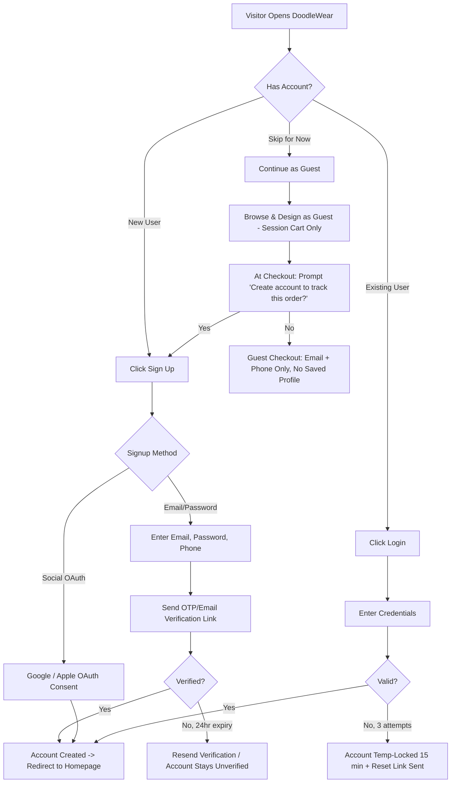

### Flow 0.2: Password Reset

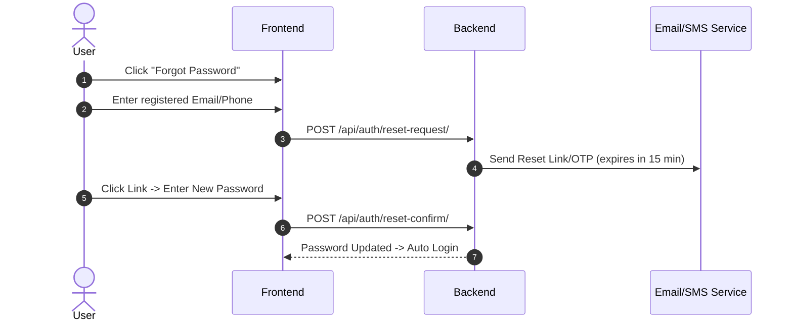

**Note:** All role dashboards (Dealer, Designer, Shipping Agency, Admin) reuse Flow 0.1's login pattern with role-based redirect after authentication, but do **not** offer guest access.

---

## 1. 🛍️ Customer Navigation Journeys

---

### Flow 1.1: Standard Catalog Shopping Flow `[MVP]`

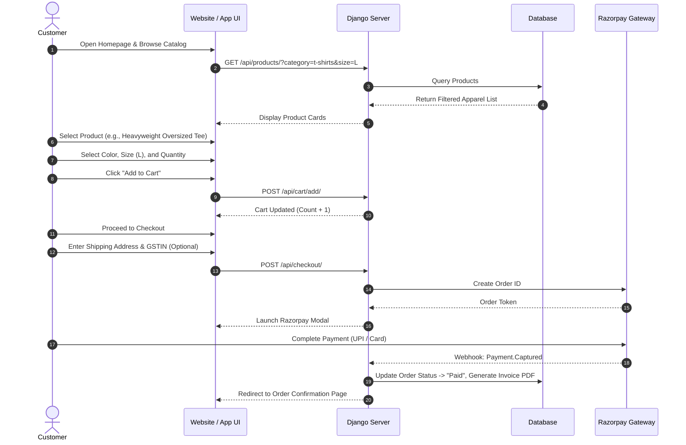

---

### Flow 1.2: AI Design Generation & Virtual Try-On Flow `[AI Enhancement]`

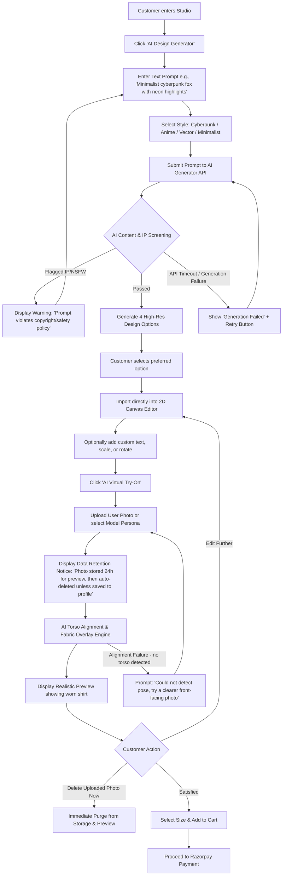

---

### Flow 1.3: Custom Image Upload & AI Superimposition Flow `[AI Enhancement]`

```mermaid
flowchart TD
    A[Customer clicks 'Upload My Artwork'] --> B[Select PNG/JPEG image from device]
    B --> C[AI Automated Content & IP Screening]

    C --> D{Perceptual Hash & NSFW Check}
    D -->|Match Trademark / NSFW| E[Block Upload: 'Copyrighted logo or inappropriate image detected']
    D -->|Passed| F[AI Background Removal Tool (Optional)]
    D -->|Scan Service Timeout| Z1[Hold Upload in 'Pending Review' + Notify Customer of Delay]
    Z1 --> C

    F --> G[AI Image-to-Apparel Superimposition Engine]
    G --> H[Auto-fit & map graphic onto apparel contours with realistic fabric folds]
    H --> I[True-Color Fabric Simulation Preview]
    G -->|Superimposition Engine Failure| Z2[Fallback: Show Flat 2D Print Preview Only + Notice]

    I --> J[Save Design Draft to Profile]
    J --> K[Select Apparel Color & Size]
    K --> L[Proceed to Checkout & Razorpay Payment]
```

---

### Flow 1.4: Defect Reprint & Return Claim Flow `[MVP]`

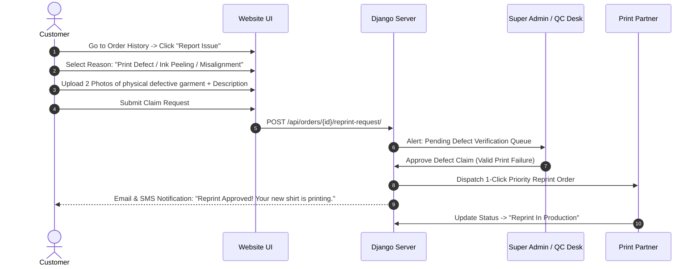

---

### Flow 1.5: Order Cancellation Flow `[MVP]` *(New)*

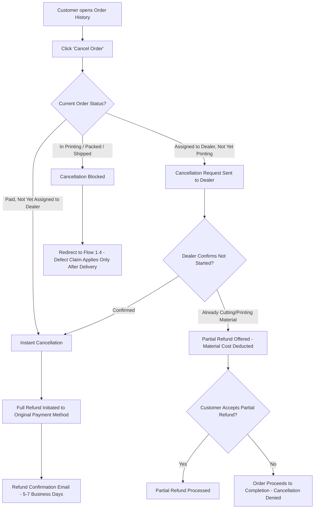

---

### Flow 1.6: Bulk / Corporate Order Flow `[Phase 3]` *(New)*

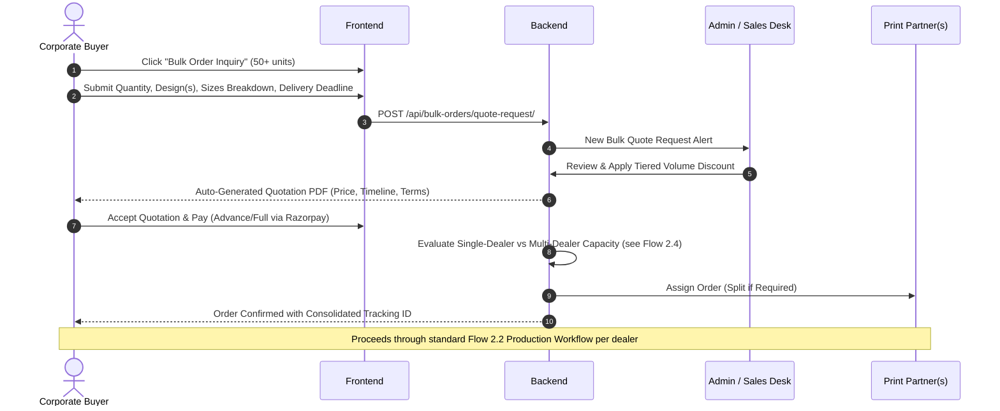

---

### Flow 1.7: Post-Delivery Review & Rating `[MVP]` *(New)*

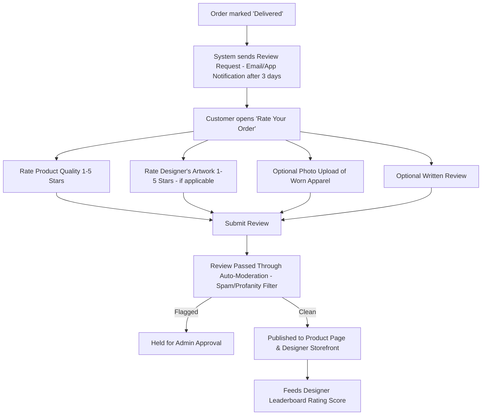

---

## 2. 🏬 Dealer / Print Partner Operations Journeys

---

### Flow 2.1: Dealer Onboarding & Certification `[MVP]`

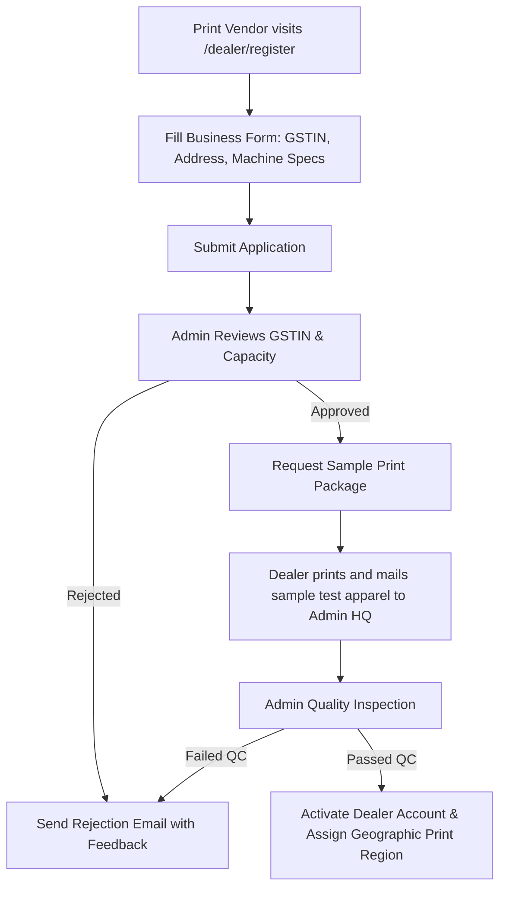

---

### Flow 2.2: Order Fulfillment & Printing Workflow `[MVP]`

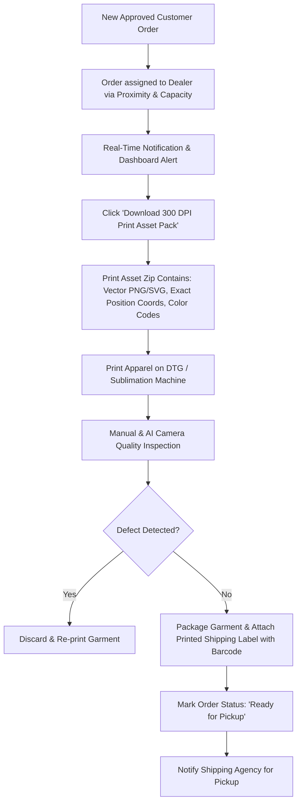

---

### Flow 2.3: Dealer Payout Processing `[MVP]` *(New)*

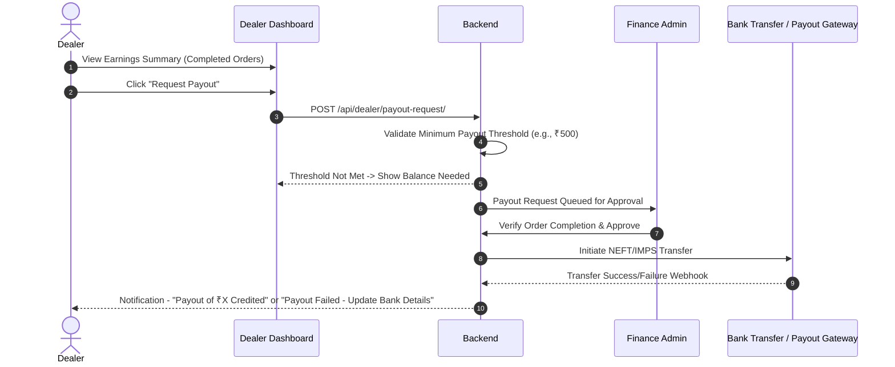

---

### Flow 2.4: Multi-Dealer Order Splitting `[Phase 3]` *(New)*

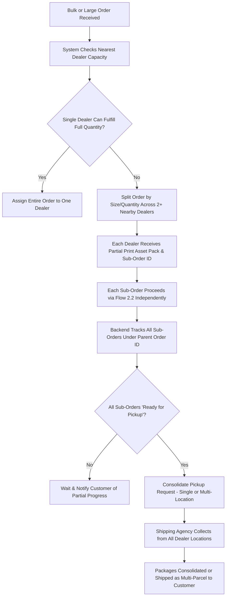

---

## 3. 🏆 Designer / Creator Journeys `[Phase 3]`

---

### Flow 3.0: Designer Application & Approval `[Phase 3]` *(New)*

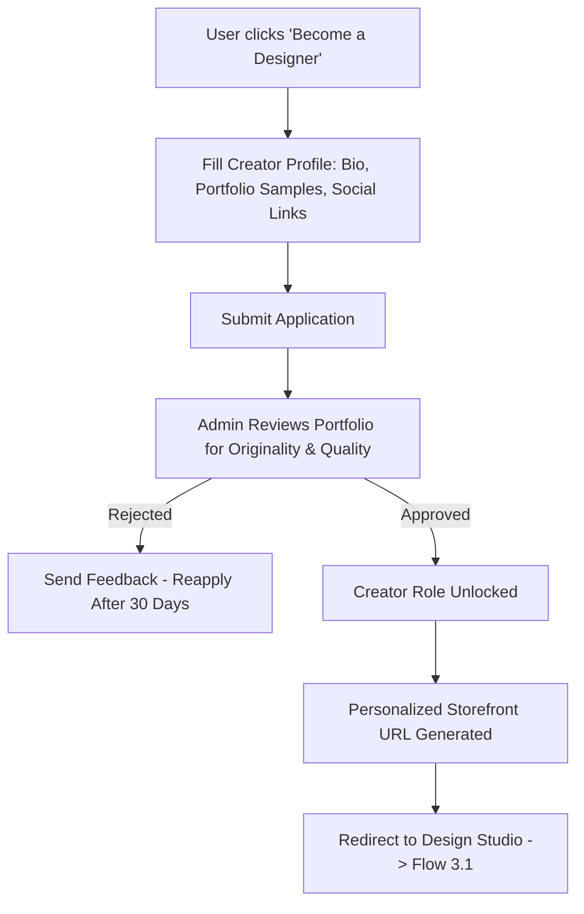

---

### Flow 3.1: Publishing Design & Earning Royalties

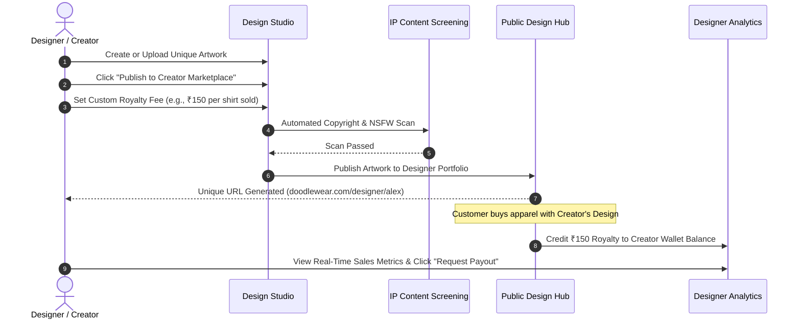

---

### Flow 3.2: Designer Payout Processing `[Phase 3]` *(New)*

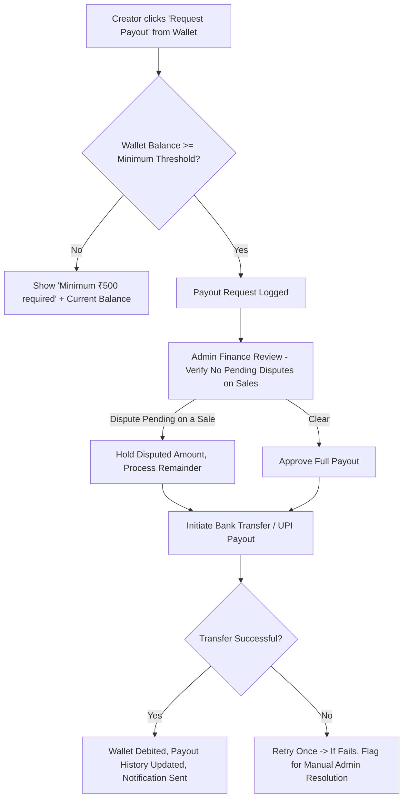

---

## 4. 🚚 Shipping Agency & Logistics Journeys `[MVP]`

---

### Flow 4.1: Pickup, Tracking & OTP Delivery Workflow

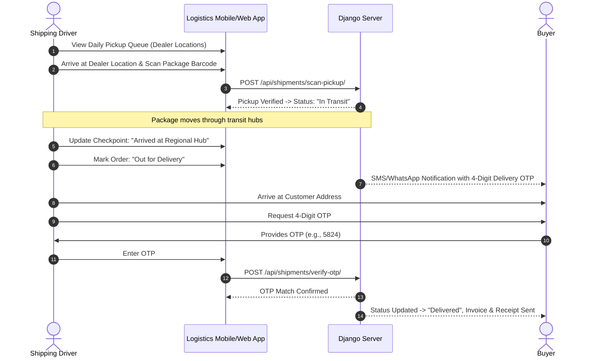

---

### Flow 4.2: Failed Delivery Attempt Recovery `[MVP]` *(New)*

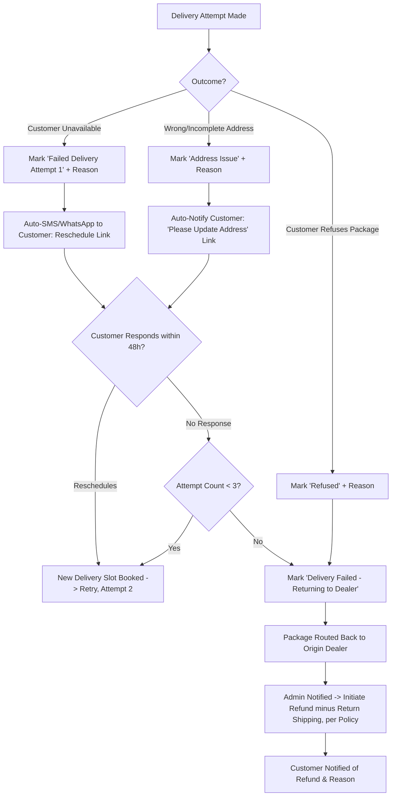

---

### Flow 4.3: Proof of Delivery Exception Handling `[MVP]`

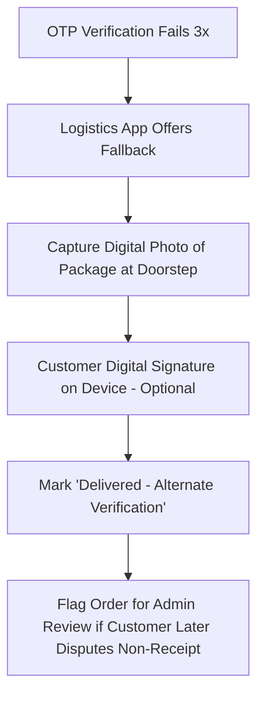

---

## 5. ⚙️ Super Admin Operations Journeys `[MVP]`

---

### Flow 5.1: Content Moderation & Fraud Inspection

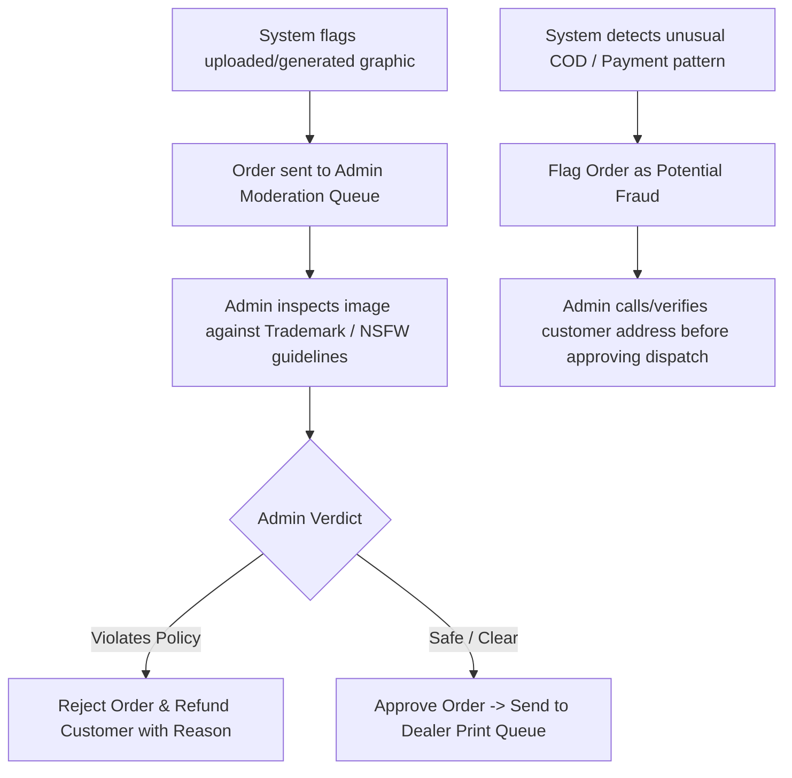

---

### Flow 5.2: Dispute & Refund Resolution `[MVP]` *(New)*

```mermaid
flowchart TD
    A[Dispute Raised] --> B{Dispute Source}
    B -->|Print Defect - No Resolution via Flow 1.4| C[Escalated Defect Dispute]
    B -->|Lost/Never Arrived Shipment| D[Shipping Dispute]
    B -->|Designer Royalty Disagreement| E[Marketplace Dispute]
    B -->|Refund Not Received| F[Payment Dispute]

    C --> G[Admin Reviews Photos, Order History, Dealer QC Logs]
    D --> H[Admin Cross-Checks Shipping Agency Tracking Logs]
    E --> I[Admin Reviews Sales Ledger vs Royalty Terms]
    F --> J[Admin Checks Razorpay Refund Webhook Status]

    G & H & I & J --> K{Verdict}
    K -->|Customer/Designer Favor| L[Process Refund / Adjust Royalty / Reissue Payout]
    K -->|Insufficient Evidence| M[Request Additional Info -> 7-Day Window]
    K -->|Denied| N[Send Explanation with Policy Reference]
    L --> O[Close Ticket & Notify All Parties]
    M --> P{Response Received?}
    P -->|Yes| K
    P -->|No| N
```

---

### Flow 5.3: Analytics & Payout Oversight `[MVP]` *(New)*

```mermaid
flowchart TD
    A[Admin Opens Analytics Dashboard] --> B[View Revenue, Active Orders, Top Designs]
    B --> C[Navigate to 'Pending Payouts' Tab]
    C --> D[Review Queued Dealer Payouts - Flow 2.3]
    C --> E[Review Queued Designer Payouts - Flow 3.2]
    D & E --> F{Approve, Hold, or Flag for Dispute Check?}
    F -->|Approve| G[Batch Process Transfers]
    F -->|Hold| H[Add Note & Notify Recipient of Delay Reason]
    F -->|Flag| I[Route to Flow 5.2 Dispute Resolution]
```

---

## 🛑 Key Edge Cases & Error Recovery Pathways

| Scenario | Possible Trigger | System Resolution / User Path |
| :--- | :--- | :--- |
| **Payment Failed** | Bank server timeout / Invalid UPI PIN | Order stays in `Pending Payment` for 30 mins; automated recovery link sent via SMS/WhatsApp. |
| **Copyright Flagged** | Uploaded image contains Nike Swoosh | Instant modal feedback explaining trademark restriction with 1-click option to remove background/replace logo. |
| **Print Defect Claim** | Ink peeling post-washing | Customer submits 2 photos; Admin verifies & triggers 1-click free dealer reprint without return friction. |
| **Wrong Delivery OTP** | Customer typed wrong number | Logistics app allows 3 retries; fallback to digital photo proof + customer signature approval (Flow 4.3). |
| **Dealer Out of Stock** | Selected shirt size/color unavailable | System automatically re-routes order to 2nd nearest certified dealer with matching stock. |
| **Order Cancellation Mid-Production** | Customer cancels after dealer starts printing | Partial refund offered (material cost deducted) or cancellation denied if already packed (Flow 1.5). |
| **AI Generation Timeout** | Design or try-on API unresponsive | Show retry prompt; do not charge or lock the customer's session (Flow 1.2 / 1.3). |
| **Failed Delivery x3** | Customer unavailable across 3 attempts | Package auto-returns to dealer; refund minus return shipping initiated (Flow 4.2). |
| **Payout Below Threshold** | Dealer/Designer balance under ₹500 | Payout request blocked with balance-needed message; auto-processes once threshold met (Flow 2.3 / 3.2). |
| **Disputed Royalty** | Designer claims underpayment | Routed to Admin Dispute Resolution with sales ledger cross-check (Flow 5.2). |
| **Guest Checkout Follow-up** | Guest wants to track order later | Order lookup via email + Order ID, with prompt to convert to full account. |

---

## 🎯 Summary of Documentation Progress

- [x] **Requirements (`features.md`)** — Complete
- [x] **User Flows (`user-flow.md`)** — Updated & Complete (Auth, Cancellation, Payouts, Designer Onboarding, Bulk Orders, Multi-Dealer Split, Failed Delivery Recovery, Dispute Resolution, Reviews)
- [ ] **Design System (`design.md`)** — *Next Step*
- [ ] **Technical Architecture (`architecture.md`)**
- [ ] **Database Schema (`database.md`)**
- [ ] **API Specification (`api.md`)**
- [ ] **Development Roadmap (`roadmap.md`)**
